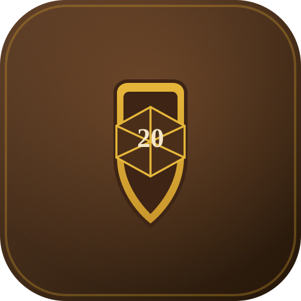
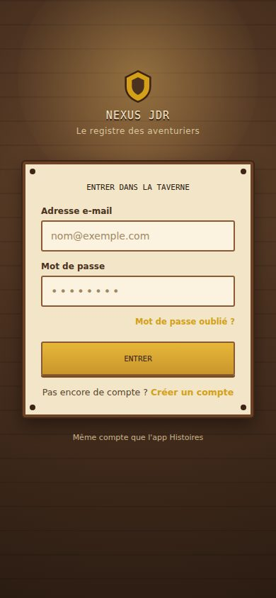
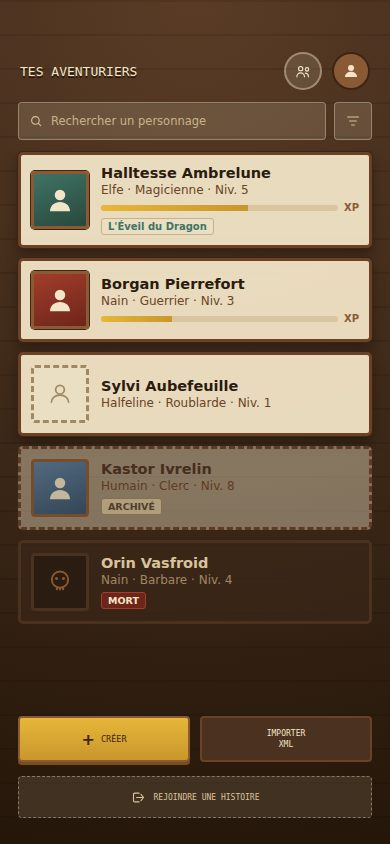
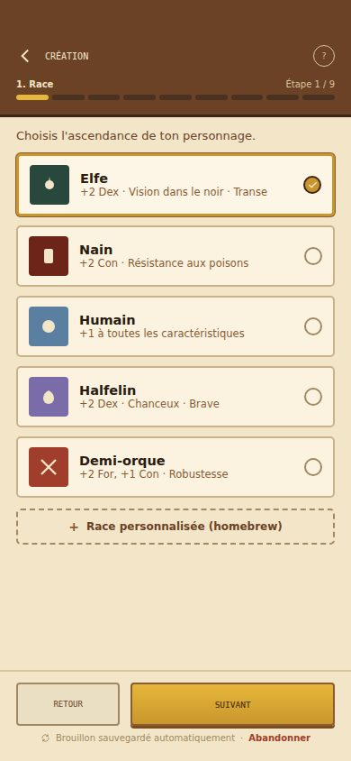
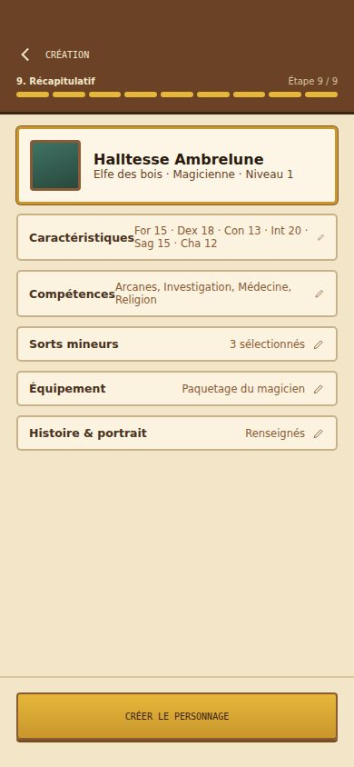
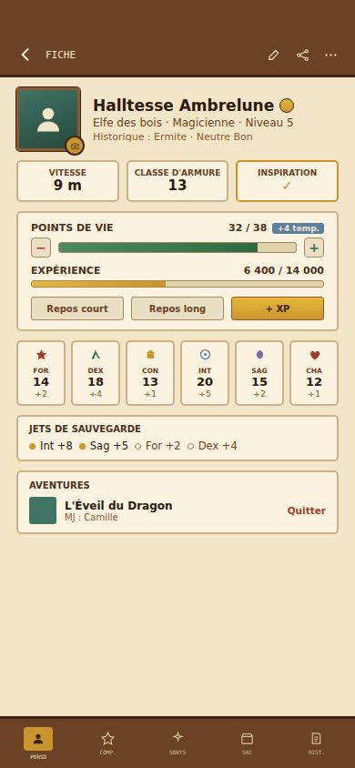
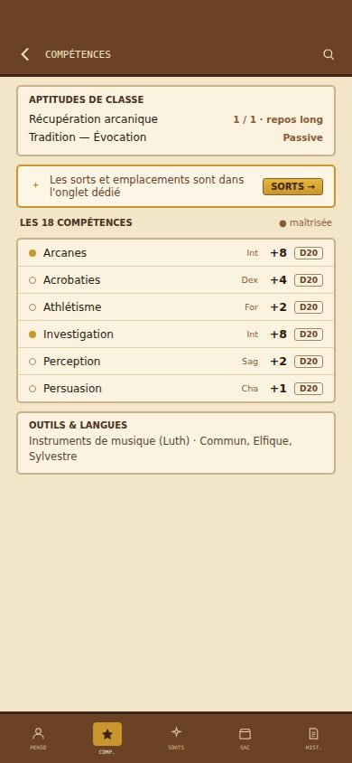
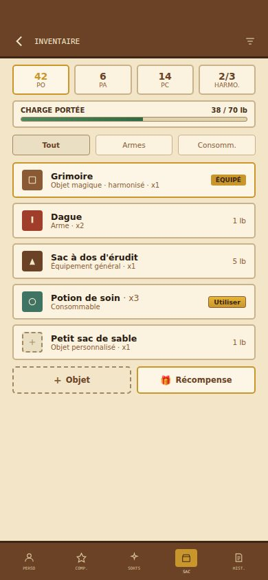
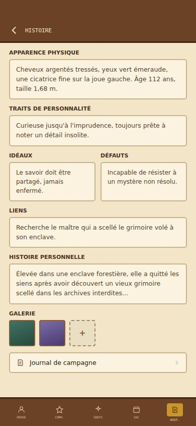

<p align="center">
  
</p>

<h1 align="center">Nexus JDR — Personnages</h1>

Application mobile Flutter pour créer et gérer des personnages de Donjons &
Dragons (5e édition). C'est le pendant "personnages" de l'app web **Nexus JDR
— Histoires** : même compte, même projet Supabase, deux applications
indépendantes qui partagent les données d'un joueur.

Un joueur peut créer un compte, se créer un ou plusieurs personnages avec un
assistant de création complet (race, classe, historique, caractéristiques,
compétences, sorts, équipement, apparence), consulter et faire vivre leur
fiche (montée de niveau, repos, PV) — **sans jamais avoir besoin de l'app
web**. Un personnage peut aussi être importé depuis un export XML
aidedd.org, ou rattaché à une histoire de l'app web via un code
d'invitation (le MJ obtient alors un accès en lecture à la fiche).

Le cahier des charges complet (vision, modèle de données, UX, design
system, roadmap détaillée...) est la source de vérité du projet — voir
[`CLAUDE.md`](CLAUDE.md) pour la table des matières et où le trouver.

## Aperçu

L'application suit une direction artistique "carnet d'aventurier" — fonds
texturés, cadres en bois, typographie manuscrite pour les titres — détaillée
dans `docs/cahier-des-charges/08-direction-artistique.md` et
`10-design-system.md`. Les écrans actuellement implémentés :

- **Connexion** ([`login_screen.dart`](lib/features/auth/presentation/login_screen.dart)) — compte partagé avec l'app web (Supabase Auth).
- **Liste des personnages** ([`character_list_screen.dart`](lib/features/characters/presentation/character_list_screen.dart)) — cartes personnage (portrait, race/classe, niveau).
- **Assistant de création**, 9 étapes avec barre de progression :
  1. Race ([`race_step_screen.dart`](lib/features/character_creation/presentation/race_step_screen.dart))
  2. Classe ([`class_step_screen.dart`](lib/features/character_creation/presentation/class_step_screen.dart))
  3. Historique ([`background_step_screen.dart`](lib/features/character_creation/presentation/background_step_screen.dart))
  4. Caractéristiques ([`ability_score_step_screen.dart`](lib/features/character_creation/presentation/ability_score_step_screen.dart))
  5. Compétences et outils ([`skills_and_tools_step_screen.dart`](lib/features/character_creation/presentation/skills_and_tools_step_screen.dart))
  6. Sorts ([`spells_step_screen.dart`](lib/features/character_creation/presentation/spells_step_screen.dart)) — sauté pour les classes non lanceuses de sorts
  7. Équipement ([`equipment_step_screen.dart`](lib/features/character_creation/presentation/equipment_step_screen.dart))
  8. Apparence et histoire personnelle ([`appearance_and_backstory_step_screen.dart`](lib/features/character_creation/presentation/appearance_and_backstory_step_screen.dart))
  9. Récapitulatif et création ([`summary_step_screen.dart`](lib/features/character_creation/presentation/summary_step_screen.dart)) — seule étape qui écrit en base
- **Fiche personnage** ([`character_detail_screen.dart`](lib/features/characters/presentation/character_detail_screen.dart)) — 4 onglets, tous avec un contenu réel :
  1. Personnage — identité, caractéristiques, jets de sauvegarde, points de vie ajustables, apparence physique, portrait avec recadrage, repos court/long, montée de niveau, section "Aventures" (histoires rejointes, voir plus bas).
  2. Compétences ([`character_skills_tab_body.dart`](lib/features/characters/presentation/widgets/character_skills_tab_body.dart)) — aptitudes de classe, les 18 compétences avec bonus calculé, maîtrises d'outils, langues connues, sorts connus/préparés par niveau avec emplacements disponibles.
  3. Inventaire/Sac ([`character_inventory_tab_body.dart`](lib/features/characters/presentation/widgets/character_inventory_tab_body.dart)) — monnaie, liste des objets avec catégorie/poids/statut équipé.
  4. Histoire ([`character_story_tab_body.dart`](lib/features/characters/presentation/widgets/character_story_tab_body.dart)) — apparence, personnalité, idéaux/défauts, liens, histoire personnelle, alliés, particularités, trésor.

  Les onglets Compétences/Inventaire/Histoire restent en **lecture seule** à ce stade : les actions d'écriture au-delà de PV/XP/niveau/repos (lancer un sort, équiper/utiliser/retirer un objet, ajuster la monnaie, décompte d'usage d'aptitude) ne sont pas encore câblées — voir "Reste à faire".
- **Montée de niveau** — déclenchement automatique dès que l'XP franchit un seuil, choix à faire selon la classe (caractéristiques/dons, sorts appris, etc.), calcul des PV et des emplacements de sorts, récapitulatif avant validation.
- **Import de personnage XML** ([`xml_import_review_screen.dart`](lib/features/xml_import/presentation/xml_import_review_screen.dart)) — sélection d'un export aidedd.org, parsing et résolution des champs (par nom pour les champs en clair, par table de correspondance pour les champs codés — voir [`docs/xml-import-reference-mapping.md`](docs/xml-import-reference-mapping.md)), écran de vérification avec correction manuelle des champs non reconnus, sauvegarde comme un personnage créé manuellement.
- **Rejoindre une histoire** ([`lib/features/join_story/`](lib/features/join_story/)) — parcours en 4 étapes (code d'invitation → confirmation → choix du personnage → validation) qui rattache un personnage à une histoire de l'app web "Histoires" via deux edge functions Supabase dédiées ; section "Aventures" sur la fiche personnage pour consulter/quitter les histoires rejointes.

### Maquettes

Ci-dessous quelques maquettes issues de `docs/cahier-des-charges/09-maquettes-captures.md`
(rendu statique généré avec Claude Design pendant le cadrage — pas des
captures de l'app réelle, mais la référence visuelle que l'implémentation
suit). La liste complète des 19 écrans maquettés vit dans ce document.

<table>
  <tr>
    <td align="center" width="25%"><br><sub>Connexion</sub></td>
    <td align="center" width="25%"><br><sub>Liste des personnages</sub></td>
    <td align="center" width="25%"><br><sub>Création — étape Race</sub></td>
    <td align="center" width="25%"><br><sub>Création — Récapitulatif</sub></td>
  </tr>
  <tr>
    <td align="center" width="25%"><br><sub>Fiche — Personnage</sub></td>
    <td align="center" width="25%"><br><sub>Fiche — Compétences</sub></td>
    <td align="center" width="25%"><br><sub>Fiche — Inventaire</sub></td>
    <td align="center" width="25%"><br><sub>Fiche — Histoire</sub></td>
  </tr>
</table>

## Stack technique

- **Flutter** + `supabase_flutter` (auth, données, storage des portraits).
- **Riverpod** (`flutter_riverpod` + `riverpod_generator`) pour la gestion d'état.
- **go_router** pour la navigation déclarative (assistant par étapes, onglets de fiche).
- **freezed** + `json_serializable` pour les modèles immuables.
- **drift** (SQLite) pour le cache offline — données de référence (races/classes/sorts/objets...), lecture de la fiche personnage ouverte, et file de synchronisation pour les écritures PV/XP effectuées hors connexion.
- Configuration par flavor (`dev` / `staging` / `prod`) via `--dart-define-from-file`, voir [`config/README.md`](config/README.md).

## Démarrer le projet

```bash
flutter pub get
flutter run --dart-define-from-file=config/dev.json --flavor dev -t lib/main.dart
```

Il faut au préalable copier `config/dev.json.example` vers `config/dev.json`
et y renseigner l'URL/clé du projet Supabase (voir
[`config/README.md`](config/README.md) — un seul projet Supabase existe pour
l'instant, partagé par les trois flavors).

## Tests

- `flutter test` : suite unitaire/widgets habituelle (`test/`), rapide, sans
  réseau — repose sur des doubles factices pour les repositories Supabase.
- `test_integration/` : tests d'intégration contre un vrai stack Supabase
  local (Postgres/PostgREST/RLS réels). Voir
  [`test_integration/README.md`](test_integration/README.md).

## État d'avancement

Suit la roadmap détaillée dans `docs/cahier-des-charges/06-roadmap.md`.

### Fait

- [x] Phase 0 — cadrage technique, bootstrap du projet Flutter, connexion Supabase, choix `drift` pour le cache offline, flavors dev/staging/prod.
- [x] Phase 1 — socle de données D&D de base (races/sous-races, classes, historiques, compétences, alignements, sorts et objets du Manuel des Joueurs), modèle i18n générique (table `translations`).
- [x] Phase 2 — application mobile V1 :
  - [x] Authentification (compte partagé avec l'app web).
  - [x] Liste des personnages.
  - [x] Assistant de création de personnage complet (9 étapes, y compris gestion du multiclassage de sorts/non-sorts et calcul des points de vie/modificateurs).
  - [x] Fiche personnage complète, 4 onglets : Personnage (identité, caractéristiques, jets de sauvegarde, PV ajustables, apparence physique, portrait, repos court/long), Compétences (aptitudes, 18 compétences, outils/langues, sorts), Inventaire (monnaie, objets), Histoire (apparence, personnalité, backstory).
  - [x] Montée de niveau (déclenchement automatique, choix selon la classe, PV, emplacements de sorts, récapitulatif).
  - [x] Mode hors-ligne : cache local `drift` pour les données de référence et la fiche personnage ouverte, file de synchronisation pour les écritures PV/XP effectuées hors connexion.
- [x] Phase 3 — import XML depuis aidedd.org : rétro-ingénierie complète des identifiants numériques ([`docs/xml-import-reference-mapping.md`](docs/xml-import-reference-mapping.md)), parseur, résolution des champs, écran de vérification/correction, sauvegarde comme un personnage manuel.
- [x] Phase 4 — synchronisation avec l'app web "Histoires" : rejoindre une histoire par code d'invitation (4 étapes), section "Aventures" sur la fiche, MJ avec accès en lecture seule au personnage rattaché. Préalable côté dépôt web fait et déployé (colonnes `invite_code`/`invite_code_enabled`, table `character_campaigns` + RLS, edge functions `preview-story-invite`/`join-story`).

### Reste à faire

- [ ] Actions d'écriture des onglets Compétences/Inventaire/Histoire : lancer un sort (consommation d'emplacement), décompte d'usage d'aptitude, équiper/déséquiper/utiliser/retirer un objet, ajuster la monnaie, ajouter un objet/une récompense, panneau "Infos" détaillé (sort/objet).
- [ ] Deep linking universel (`nexus-jdr.app/join/{code}` ouvre directement l'app) : le routage interne (`go_router`) et la config Android/iOS (`AndroidManifest.xml`, `Runner.entitlements`) sont en place, ainsi que les fichiers de vérification côté web (`assetlinks.json`, route `apple-app-site-association` — voir `DEEP_LINKING_SETUP.md` du dépôt web). **Bloqué sur 3 prérequis externes, aucun encore réuni** : domaine `nexus-jdr.app` pas encore hébergé, pas de keystore Android de production généré, pas de compte Apple Developer Program créé. Une fois ces 3 éléments réunis : remplacer les deux placeholders (empreinte SHA-256, Team ID) dans les fichiers de vérification web, puis raccorder `Runner.entitlements` à la signature Xcode (onglet "Signing & Capabilities", nécessite macOS/Xcode) — étapes détaillées dans `DEEP_LINKING_SETUP.md`.
- [ ] Panneau web "Joueurs" dans l'écran d'une histoire (liste des personnages rattachés, génération/révocation du lien d'invitation côté MJ) — spec fonctionnelle prête (`12-partage-et-groupes.md` section 5.6), explicitement à la charge de l'équipe qui maintient l'app Next.js, pas construit depuis ce dépôt.
- [ ] Phase 5 — extension du contenu D&D au-delà du Manuel des Joueurs (sous-classes, sorts/objets additionnels, dons, sous-races supplémentaires).
- [ ] Phase 6 — fonctionnalités complémentaires : export XML compatible aidedd.org, système de groupes, gestion du multiclassage dans l'assistant, reste du mode hors-ligne (au-delà de PV/XP) si le besoin se confirme.
- [ ] Publication sur les stores : comptes développeur (Apple/Google), génération des clés de signature, icônes/splash screen, CI/CD de release — voir `docs/cahier-des-charges/13-depot-versioning-publication.md` pour la checklist complète (rien de fait à ce stade).
- [ ] Projets Supabase distincts pour `staging`/`prod` (actuellement les trois flavors pointent vers le même projet que le dev).

## Ressources Flutter

- [Learn Flutter](https://docs.flutter.dev/get-started/learn-flutter)
- [Write your first Flutter app](https://docs.flutter.dev/get-started/codelab)
- [Flutter learning resources](https://docs.flutter.dev/reference/learning-resources)
